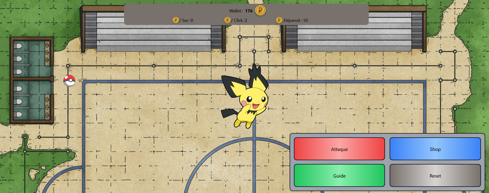
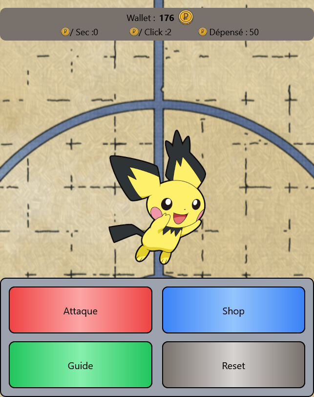

# Pickliker

Ce projet, "Pickliker", est un jeu interactif de type "cookie clicker" avec de nombreuses fonctionnalités cachées et des éléments surprenants qui s'activent au cours du jeu. Le projet a été construit en utilisant "Vite" pour une expérience de développement plus rapide et plus efficace.

## Aperçu du jeu

Pickliker a été conçu pour offrir une expérience amusante et addictive. Le jeu devient progressivement plus intéressant avec des éléments qui se débloquent, une arène qui change dynamiquement, et beaucoup plus de surprises !



Le jeu est également entièrement responsive, ce qui signifie que vous pouvez y jouer efficacement sur des appareils mobiles.



## Technologies Utilisées

- HTML
- CSS
- JavaScript
- Tailwind CSS (via CDN)
- [Font Awesome](https://fontawesome.com/) pour les icônes
- Google Fonts
- Vite

## Fonctionnalités spéciales

- **Déblocage d'éléments** : Au fur et à mesure que vous progressez dans le jeu, de nouveaux éléments se débloquent, ajoutant une dimension supplémentaire à l'expérience globale.
- **Arène dynamique** : L'arène change de manière significative lors de votre premier achat, vous récompensant et vous incitant à continuer à jouer.
- **Stockage local** : Vos scores et votre progression sont enregistrés dans le stockage local, vous pouvez donc quitter le jeu et revenir à tout moment sans perdre votre progression.
- **Classement** : Entrez votre nom pour voir où vous vous situez par rapport aux autres joueurs. Le classement est mis à jour en fonction de vos scores.
- **Pokeballs** : Utilisez les pokeballs pour randomiser les scores, ajoutant un élément de chance au jeu.
- **Évolution** : Atteignez un score de 15 000 pour débloquer une évolution. Utilisez la pierre d'évolution pour accéder à des formes encore plus puissantes !

## Structure du Projet

- `index.html` : La page principale du jeu, contenant la logique principale du "clicker".
- `style.css` : Contient les quelques ajouts CSS.
- `main.js` : La configuration générale du site.
- `script.js` : Les scripts présent sur la page.
- `img/` : Pour toutes les images utilisées dans le jeu, y compris les captures d'écran et les éléments graphiques.
- `README.md` : Ce fichier détaillant le projet et comment le configurer.
- Les fichiers ajouté par l'installation de TailwindCSS & de Vite.

## Installation

1. Clonez ce dépôt sur votre machine locale :
   ```bash
   git clone git@github.com:ahmedymh/Javascript.git
   ```
2. Depuis le dossier du projet, installez les dépendances nécessaires (si applicable) :
   ```bash
   npm install
   ```
3. Lancez le projet :
   ```bash
   npm run dev
   ```

Ceci démarrera le serveur de développement fourni par Vite.

4. Ouvrez votre navigateur et accédez à `http://localhost:3000` (ou un autre port si vous avez configuré différemment) pour commencer à jouer.

## Personnalisation

Le jeu est hautement personnalisable. Les développeurs peuvent ajuster les règles, le style, et ajouter de nouvelles fonctionnalités en modifiant les fichiers de code source.

## Contributeurs
- Naim : [Eneuem/Eratz](https://github.com/Eneuem)
- Gwendoline : [Fainteasy/Cthulwho](https://github.com/Fainteasy)
- Ahmed : [Hmitch/Ahmedymh](https://github.com/ahmedymh)

## But
Ce projet a été réalisé dans le cadre de la formation BeCode de Bruxelles en Junior Dev (promo Swartz-8 - 2023). Il a été demandé de développer un Cookie Clicker avec quelques fonctionnalités, et pour le reste, laisser notre imagination le complexifier !
